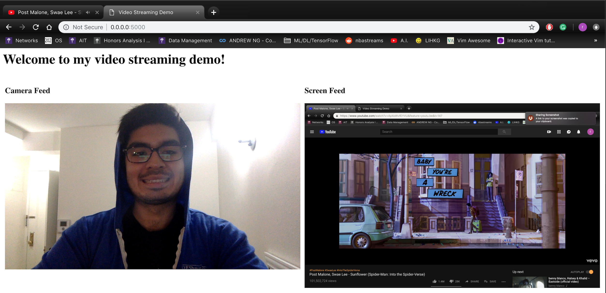

# Video Streaming Application
---
Screenshot

---
## Dependencies:
- python version 3 or above
- cv2 library
	- type `pip install opencv-python`	
- numpy library
	- strongly advised to install using `conda` package
- PIL library
	- type `pip install Pillow`
- flask library
	- type `pip install Flask`

Please refer to [this](http://flask.pocoo.org/docs/1.0/installation/) for setting up Flask server application.

---
After installing the libraries listed above, run the following on terminal:

- `export FLASK_APP=main.py`
- `flask run --host=0.0.0.0`

---
Reference: [this](http://www.chioka.in/python-live-video-streaming-example/)